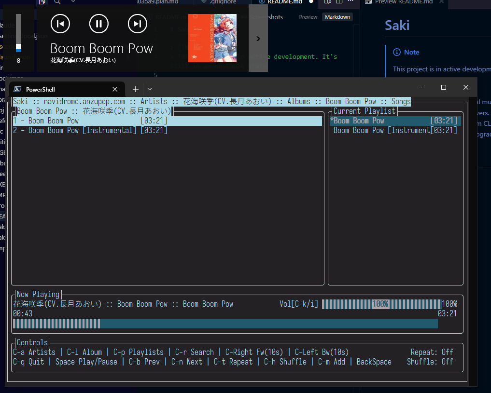

# Saki

<!-- Add to your README -->
[](https://sladge.net)

> [!NOTE]  
> This project actively uses Claude Opus 4.6 (Max) and GPT 5.4 (Thinking) to refactor legacy code and ships new functionality. Due to the nature of Terminal GUI application some GUI may not be tested.

> [!IMPORTANT]  
> This project is in active development. It's still in an unstable state and is not ready for production use.

> [!WARNING]  
> Proceed with your own risk. This project is not fully tested and has known bugs. While the author is working on it, you are also welcome to submit issues and feature requests.

Saki is a cross-platform terminal music player for subsonic compatible music servers.
It's a predecessor of [SonicLair.Cli](https://github.com/xiongnemo/SonicLair.Cli) and derived from CLI version of [SonicLair.Net](https://github.com/thelinkin3000/SonicLair.NET), but with many upgrades and changes.

## Run
```pwsh
dotnet run --project src\Saki.Terminal\Saki.Terminal.csproj
```
## Screenshots



## Libraries and Frameworks

- [.NET 10](https://dotnet.microsoft.com/en-us/download/dotnet/10.0)

- [Terminal.Gui v2](https://github.com/gui-cs/Terminal.Gui/tree/v2_release)

- [SoundFlow](https://github.com/LSXPrime/SoundFlow) with [MiniAudio](https://github.com/mackron/miniaudio) as the audio backend
