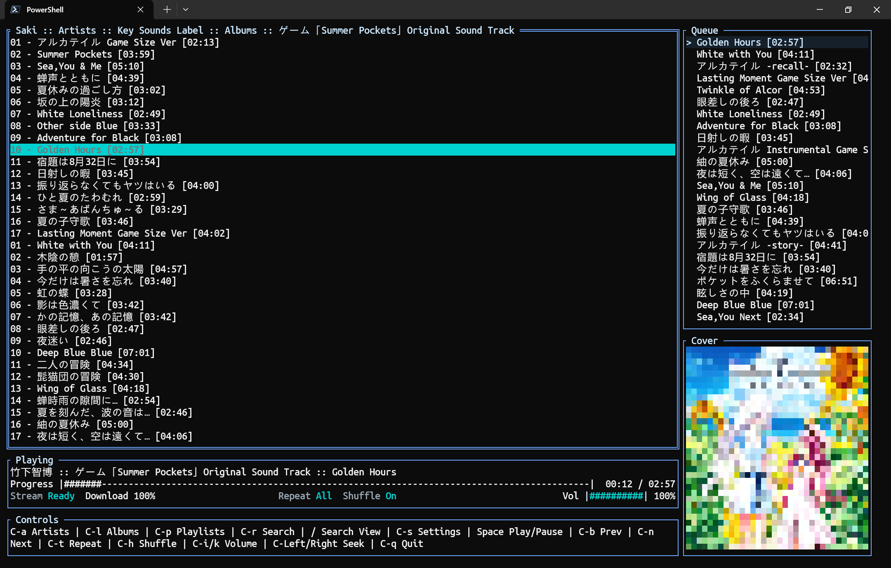
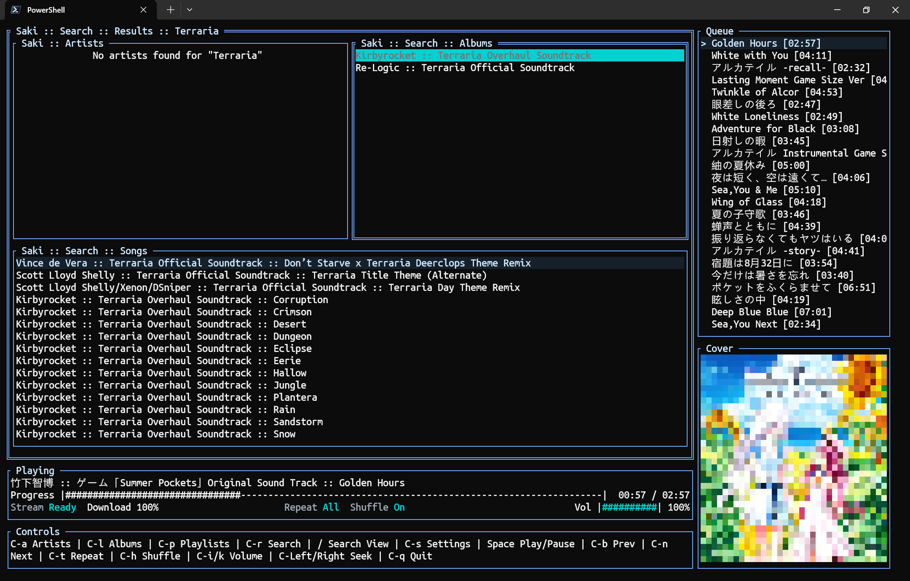
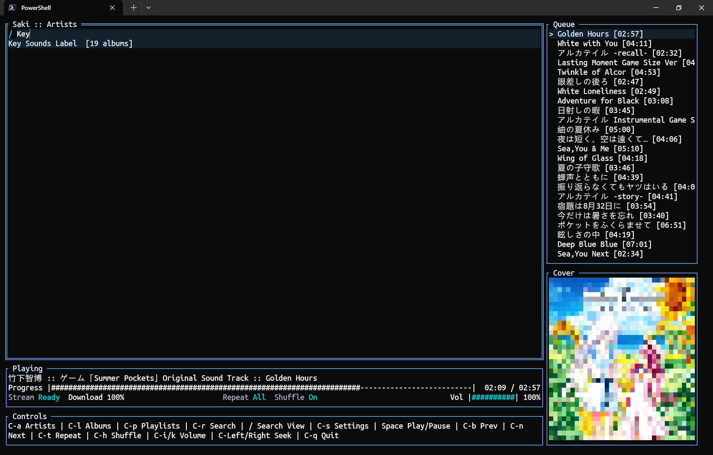
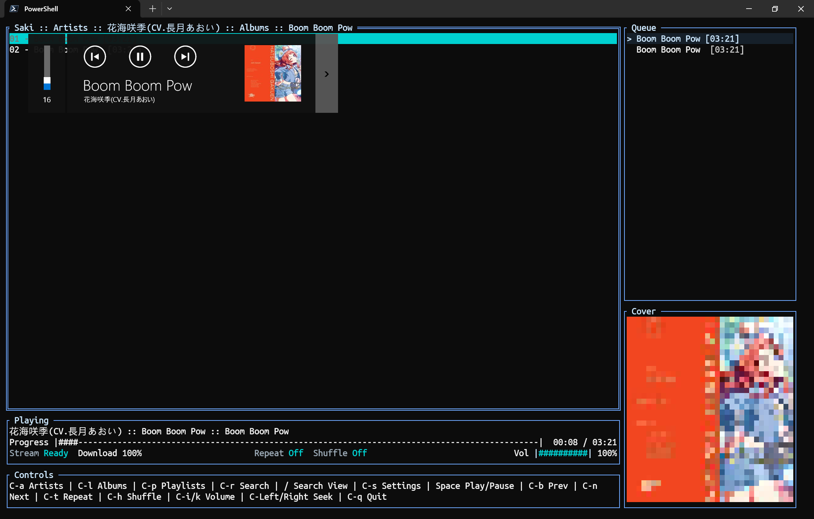

# Saki

<!-- Add to your README -->
[](https://sladge.net)

> [!NOTE]  
> This project actively uses GPT 5.5 (Thinking) on Codex to refactor legacy code and ships new functionality. Due to the nature of Terminal GUI application some GUI may not be tested.

> [!IMPORTANT]  
> This project is in active development. It's still in an unstable state and is not ready for production use.

> [!WARNING]  
> Proceed with your own risk. This project is not fully tested and has known bugs. While the author is working on it, you are also welcome to submit issues and feature requests.

## What Is Saki?

Saki is a cross-platform Subsonic Audio Klient for Individuals. It's a terminal-based music player for Subsonic-compatible music servers, a successor of [SonicLair.Cli](https://github.com/xiongnemo/SonicLair.Cli) and derived from the CLI version of [SonicLair.Net](https://github.com/thelinkin3000/SonicLair.NET), but rewritten in Go with a TUI built on `tview` and `tcell`.

## Features

- Browse Subsonic-compatible libraries by artists, albums, and playlists.
- Global search across artists, albums, and songs.
- In-view filtering with `/` for supported lists.
- Queue navigation with keyboard focus, mouse selection, and double-click playback.
- Queue-side album cover preview with terminal image protocol support and color-block fallback.
- Now Playing panel with progress, stream/cache state, audio format details, repeat, shuffle, and volume controls.
- Multiple playback backends: default `auto` tries miniaudio first for MP3/WAV/FLAC and Range-capable or completed-cache ALAC/M4A, then falls back to optional `mpv` for unsupported sources.
- Local stream proxy with playback-time buffering and completed-file audio cache.
- Seeking support when the current backend/source can provide a seekable stream or cached file.
- System page with About, Settings, runtime properties, endpoint validation, and live endpoint ping/status.
- Windows SMTC integration through a small C++/WinRT DLL shim.
- Versioned builds and `--version` / `-v` output with branch, commit, and dirty state.

## Screenshots

### Overview



### Global Search



### In-view Search



### Windows SMTC Integration



## Run

```pwsh
$env:GOPROXY = 'https://goproxy.cn,direct'
go run ./cmd/saki
```

Print the build version without starting the TUI:

```pwsh
go run ./cmd/saki --version
```

For local playback, install `mpv` so `mpv.exe` is on `PATH`, or set the full
`mpv.exe` path in the System page if you want to use the optional mpv
backend. System is available from the main screen with `Ctrl+S`.

## Build On Windows

```pwsh
$env:GOPROXY = 'https://goproxy.cn,direct'
.\scripts\build-windows.ps1
.\dist\saki-windows-amd64\saki.exe
```

The build script builds or reuses the Windows SMTC shim with MSVC/Windows SDK,
runs Go tests, embeds `saki_smtc.dll` into `saki.exe`, and then builds the Go
executable. The default miniaudio backend uses cgo, so Windows builds also need
a working MinGW-w64/GCC toolchain. If you already have a built shim and only
want to skip rebuilding it, pass `-SkipSMTC`.

`mpv` is optional. Install it or set its path in System only when using the
`mpv` backend or the `auto` fallback for non-seekable or unsupported sources.

## Runtime Requirements

The default miniaudio backend has no external runtime player dependency for
MP3/WAV/FLAC and Range-capable or completed-cache ALAC/M4A files. The optional
mpv backend starts mpv with JSON IPC and feeds it local proxy URLs, and remains
available as a fallback for unsupported or non-Range-capable sources.

## Release Builds

Pushes to `dev` build prerelease artifacts for Linux, Windows, and macOS. The
workflow targets `amd64`, `arm64`, and `i686` for Linux and Windows, and
`amd64` and `arm64` for macOS. Artifacts are published to a GitHub prerelease
named like `v0.0.1-dev-06b7a4654205`.

Each build embeds version metadata in this format:

```text
v{major}.{minor}.{patch}-{branch}-{commit12}[-dirty]
```

For CI and build-script releases, `patch` is derived from Git history: the
nearest exact `vMAJOR.MINOR.PATCH` tag plus the number of commits since that
tag. If no exact release tag exists, builds use `v0.0.1` as the fallback base
and add the current commit count.

To bump `major` or `minor`, create an exact semver tag on the desired base
commit, for example `v0.1.0`. That tagged commit builds as `v0.1.0-...`; the
next commit builds as `v0.1.1-...`. Dev prerelease tags like
`v0.0.1-dev-06b7a4654205` are ignored for the patch calculation.

## Windows SMTC Shim

Windows builds embed `saki_smtc.dll` into the Go executable. At runtime, Saki
extracts the embedded shim to `%LOCALAPPDATA%\Saki\smtc\saki_smtc.dll` and
loads it from that stable cache path.

During development, `go run ./cmd/saki` can start without a compiled shim, but
Windows SMTC stays disabled unless `saki_smtc.dll` is available beside the
executable, in the working directory, under
`internal/mediaintegration/smtc_shim/windows`, or on `PATH`. Release builds use
`scripts/build-windows.ps1`, which builds or reuses the shim and compiles with
the `saki_embed_smtc` tag so the DLL is embedded into `saki.exe`.

## Libraries and Frameworks

- [Go](https://go.dev/) for the main application.
- [C++/WinRT](https://learn.microsoft.com/windows/uwp/cpp-and-winrt-apis/) for the Windows SMTC shim.
- [PowerShell](https://learn.microsoft.com/powershell/) for Windows build scripting.
- [GitHub Actions](https://github.com/features/actions) for prerelease builds.
- [tview](https://github.com/rivo/tview) and [tcell](https://github.com/gdamore/tcell) for the terminal UI.
- [malgo](https://github.com/gen2brain/malgo) with [miniaudio](https://github.com/mackron/miniaudio) for the default native audio backend.
- [mpv](https://mpv.io/) as an optional external playback backend and fallback.
- [go-mp3](https://github.com/hajimehoshi/go-mp3) for MP3 decoding.
- [mewkiz/flac](https://github.com/mewkiz/flac) for FLAC decoding.
- [saprobe-alac](https://github.com/mycophonic/saprobe-alac) for ALAC/M4A decoding.
- [rasterm](https://github.com/BourgeoisBear/rasterm) for terminal image protocol encoding.
- [go-winio](https://github.com/microsoft/go-winio) for Windows named pipe support.
